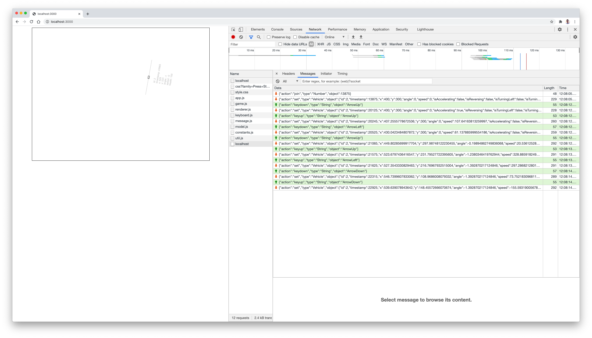

# Exercise 6

You are asked to make the game multiplayer with websocket.
Upon loading the webpage, the game opens a websocket connection with the server for bidirectional communication.

## State replication

Start by getting a clear understanding of the `Game` (server-side) and `Replica` (client-side) classes in the `game.js` file.
In particular, look at the callback mechanism (`messageListener`) in the `Game` class.
This callback mechanism will be used to implement the communication protocol.

## Messages

The following screenshot illustrates the message used to replicate the state from the server to the browsers.



### Join Messages

The join messages are sent by the server and are aimed at synchronizing the clocks of the participants.

```
{
    "action":"join",
    "type":"Number",
    "object":13875
}
```

### Set and Delete Messages

The set and delete messages are sent by the server to replicate the state of the server (Game class) with the connected browsers (Replica class).

```
{
    "action":"set",
    "type":"Vehicle",
    "object":{
        "id":2,
        "timestamp":20125,
        "x":400,
        "y":300,
        "angle":0,
        "speed":0,
        "isAccelerating":true,
        "isReversing":false,
        "isTurningLeft":false,
        "isTurningRight":false,
        "color":"rgb(0, 0, 0)",
        "health":100
    }
}	
```

### Keyboard Messages

The keyboard messages are sent by the browsers to the server for changing the state of the game.

```
{
    "action":"keydown",
    "type":"String",
    "object":"ArrowUp"
}
```

## Codec

The codec class serializes and deserializes messages. 
The `type` attribute of the messages should be used to assign the correct JavaScript type the objects wrapped in the messages.
Complete the `encode(message)` and `decode(string)` methods in the Codec class (`message.js`).

## Websocket

You are asked to wire the browser and the server using websocket.
Start by drawing the architecture of the application on a paper and try to get a sense of how the client and the server communicate through websocket.
Then, complete the `server.js` and `app.js` files iteratively.
Try to split this task into several steps: try to send a message from the client to the server, try to log this message on the server, try to process this message, broadcast the resulting events to the connected clients, etc.

## Collisions

Once the vehicle is moving and the replication protocol works, implement colisions detection between rockets and vehicle in the Game class.

## Evaluation

This exercise mainly consists in integration work that can difficultly be covered by unit tests. 
Therefore, we will manually evaluate your code by executing it and verifying that multiple players can join and exit the game.

## Prerequisites

- Node 16 (LTS)
  
## Setup

Install project dependencies
```sh
npm install
```

Start the server
```sh
npm run start

# or start server in watch mode
# so it automatically restarts on file changes
npm run watch
```

Run tests
```
npm run test
```